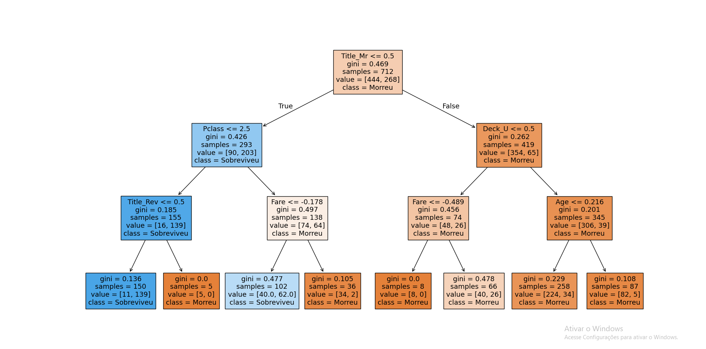
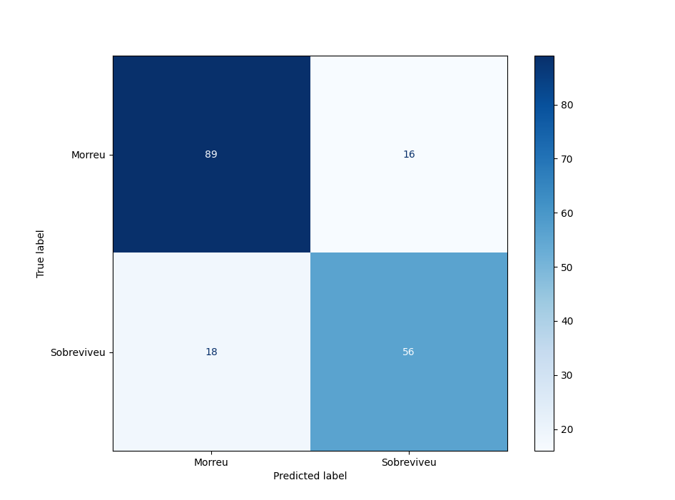
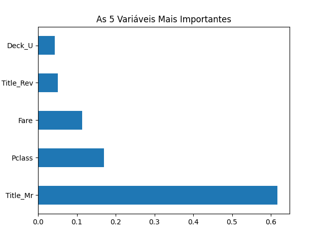

# 🚢 Titanic Data Science Project: Preparação de Dados
Este repositório contém a etapa de Data Cleaning e Feature Engineering do dataset do Titanic, seguindo as premissas do CRISP-DM para garantir que os dados estejam prontos para modelos de Machine Learning.

## 🛠️ Etapas do Projeto
### 1. Tratamento de Dados Faltantes (Age)
Inicialmente, a estratégia comum seria aplicar a mediana geral (28 anos) em todos os valores nulos. No entanto, ao analisar a coluna Name, notei a presença de títulos (Master, Miss, Mr, etc.).

Raciocínio: Aplicar uma média única poderia "envelhecer" crianças (Master) ou "rejuvenescer" idosos. Optei por extrair o título e aplicar a mediana específica de cada grupo.

Resultado: A mediana para Master foi de 3.5 anos, enquanto para Mr foi de 30.0, tornando os dados muito mais assertivos.

### 2. Análise de Outliers (Fare)
Utilizei o método do Intervalo Interquartil (IQR) para identificar valores discrepantes na coluna de tarifas.

Estratégia: Embora identificados, optei por não remover os outliers. Em um cenário de naufrágio, o poder aquisitivo (tarifas mais altas) é uma variável crítica para a probabilidade de sobrevivência ("Mulheres e crianças da primeira classe primeiro").

### 3. Feature Engineering: Criando a coluna Deck
A coluna Cabin continha informações complexas. Extraí apenas a primeira letra para identificar o Deck (andar do navio) e tratei valores nulos como 'U' (Unknown).

### 4. Codificação de Variáveis Categóricas
Para que os algoritmos matemáticos processem os textos, utilizei duas técnicas distintas:

Label Encoding: Aplicado na coluna Sex (transformando em 0 e 1).

One-Hot Encoding (get_dummies): Aplicado em Embarked e Deck, criando colunas binárias para evitar que o modelo interprete uma ordem de importância inexistente entre os portos ou andares.

### 5. Escalonamento de Variáveis (Scaling)
Para evitar que o modelo seja enviesado por colunas com grandezas diferentes (como Fare, que chega a 512, e Age, que chega a 80), utilizei o StandardScaler.

Objetivo: Colocar todos os dados na mesma escala (média 0 e desvio padrão 1), garantindo que a IA dê a importância correta a cada característica.

### 6. Divisão dos Dados (Train-Test Split)
Para garantir uma avaliação imparcial do modelo, utilizei a técnica de Train-Test Split. Os dados foram divididos na proporção de 80% para treinamento e 20% para teste, utilizando o random_state=42 para garantir a reprodutibilidade dos resultados.

Variável Alvo (y): Survived (indica se o passageiro sobreviveu ou não).

Variáveis Preditoras (X): Todas as demais características processadas (Idade, Sexo, Classe, etc.).

### 7. Árvore de Decisão
O primeiro algoritmo escolhido foi a Árvore de Decisão. Para evitar o Overfitting (quando o modelo decora os dados de treino mas não generaliza para novos dados), limitei a profundidade máxima da árvore (max_depth) em 3.

Após realizar o fit com os dados de treino e o predict com os dados de teste, o modelo alcançou uma Acurácia de 81%.

### 8. Matriz de Confusão
Para ir além da acurácia, gerei uma Matriz de Confusão. Ela permite visualizar o desempenho do algoritmo em cada categoria, identificando:

Verdadeiros Positivos/Negativos: Acertos do modelo.

Falsos Positivos/Negativos: Erros de classificação (onde o modelo se "confundiu").

### 9. Análise de Relevância (Feature Importance)
Utilizei o atributo feature_importances_ para extrair quais variáveis foram mais determinantes para as decisões do modelo. Esta etapa é fundamental para a Explicabilidade da IA.

Como demonstrado no gráfico, as variáveis de maior peso foram o Título (que sintetiza gênero e idade) e a Classe social.

### 10. Random Forest

O Random Forest é um algoritmo que combina múltiplas Árvores de Decisão (neste caso, 100) para gerar uma previsão mais robusta. Em problemas de classificação, o modelo utiliza o critério de votação majoritária entre as árvores; já em regressão, calcula a média das previsões individuais.

Apliquei esse algoritmo com o objetivo de comparar seu desempenho com o da Árvore de Decisão previamente utilizada. Após o treinamento e avaliação, ambos os modelos apresentaram a mesma acurácia de 82%.

Esse resultado pode ser explicado pelo fato de o dataset do Titanic ser relativamente pequeno e bem estruturado, o que limita o ganho de performance que técnicas mais complexas como o Random Forest podem oferecer.

### 11. Regressão Logística com Pipeline e Validação Cruzada
A Regressão Logística foi implementada para atuar como um modelo linear de classificação, buscando entender a probabilidade de sobrevivência com base nas variáveis do dataset. Diferente das abordagens anteriores, este tópico introduz uma estrutura de engenharia de software mais robusta:

Pipeline de Dados: Utilizei a classe Pipeline do Scikit-Learn para encapsular todo o fluxo de trabalho, desde o pré-processamento (como o StandardScaler e OneHotEncoder) até a execução do modelo. Isso garante que as transformações sejam aplicadas de forma consistente tanto nos dados de treino quanto nos de teste, evitando o vazamento de dados (data leakage).

Validação Cruzada (Cross-Validation): Em vez de uma única divisão entre treino e teste, apliquei o método K-Fold com 5 dobras (cv=5). O cross_val_score treina e avalia o modelo cinco vezes em diferentes partes do dataset, fornecendo uma acurácia média muito mais confiável e representativa da realidade do modelo.

Interpretabilidade: Graças à estrutura do Pipeline, foi possível acessar os coeficientes do modelo final de forma isolada. Isso permitiu identificar quais variáveis (como Sexo e Classe) possuem maior peso matemático na determinação das chances de sobrevivência.

A utilização desta abordagem demonstra não apenas a aplicação do algoritmo em si, mas a implementação de boas práticas de Programação Orientada a Objetos (POO) aplicadas à Ciência de Dados, tornando o código modular, escalável e pronto para ambientes de produção.

## 🏆 Conclusão
Neste projeto, percorri todo o pipeline de Ciência de Dados: desde a extração e limpeza (Data Cleaning) até a engenharia de recursos (Feature Engineering) e modelagem.

O modelo de Árvore de Decisão confirmou, através dos dados, a máxima histórica do desastre: passageiros com títulos femininos/infantis e aqueles hospedados em classes superiores tiveram chances significativamente maiores de sobrevivência. O projeto resultou em um modelo robusto com 81% de precisão em dados nunca vistos.
